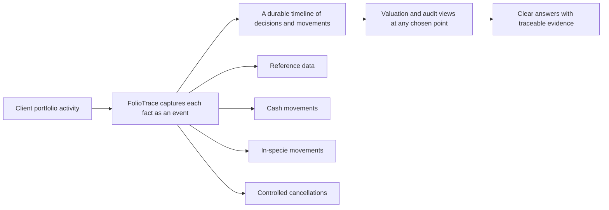
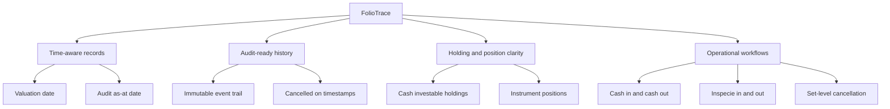
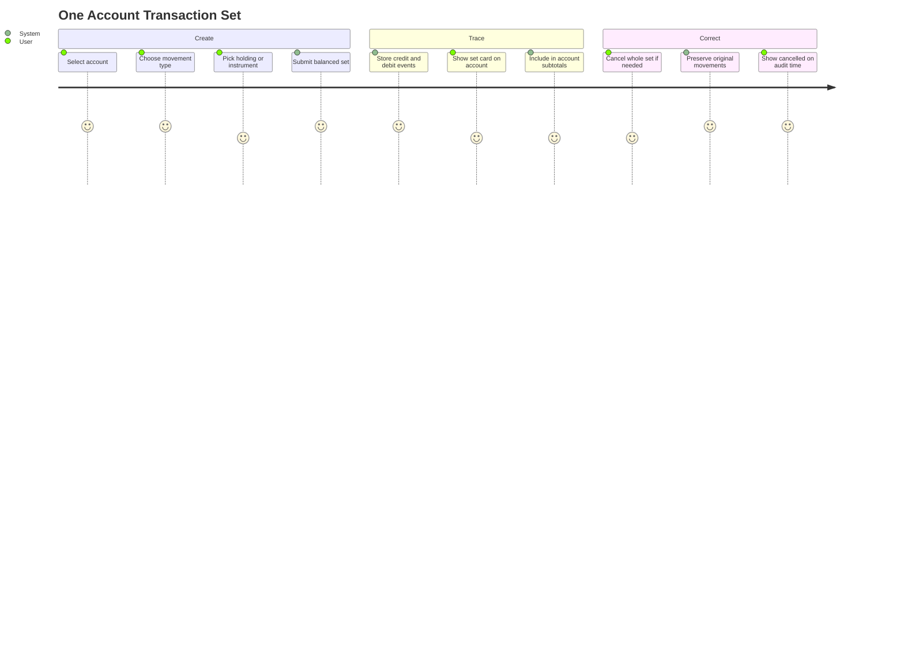
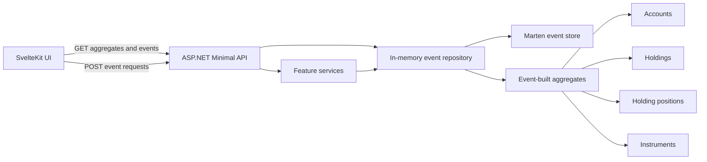
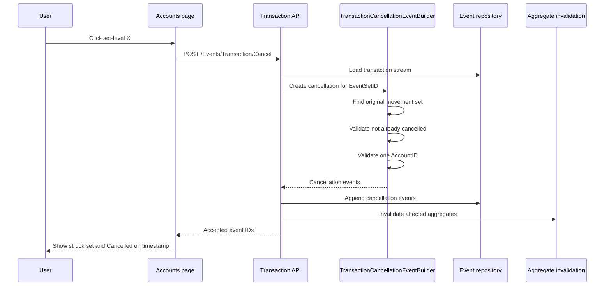
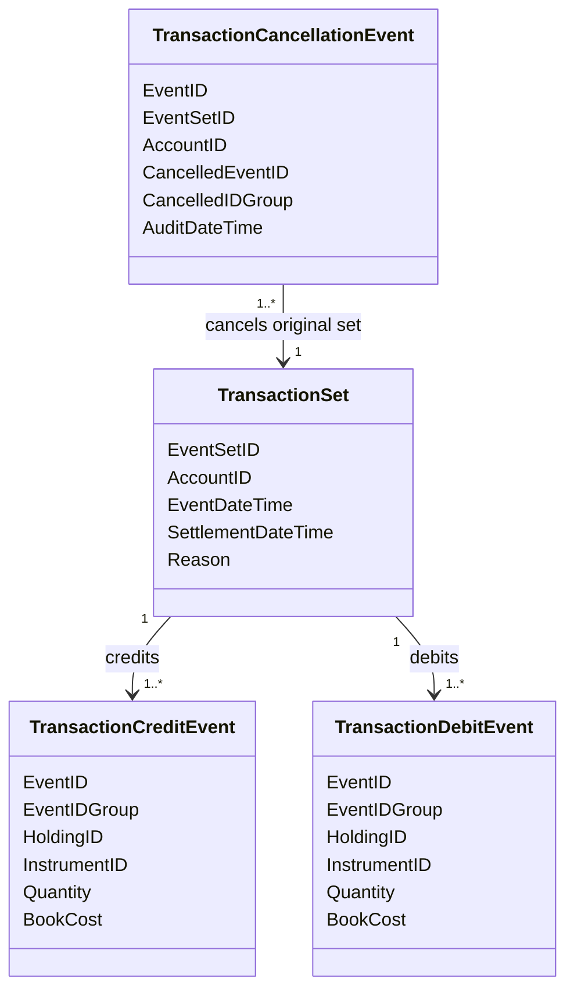
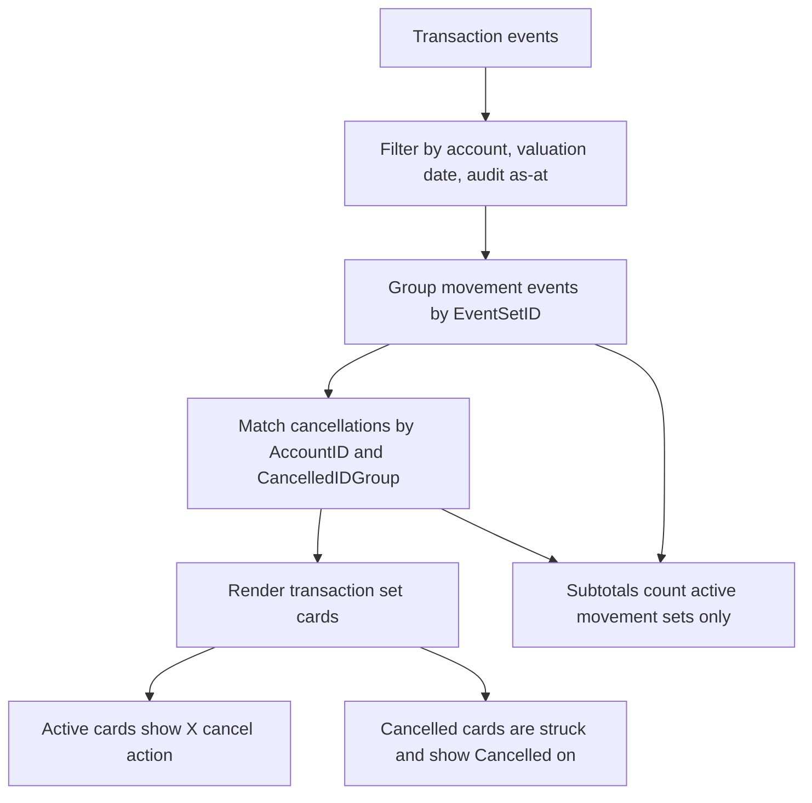
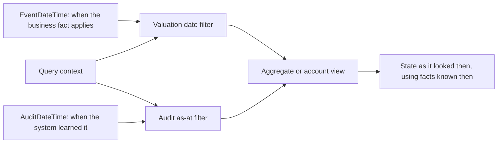

# FolioTrace Schematic Diagrams

These diagrams are split into marketing-oriented views and technical-review views. They use Mermaid so they can be rendered directly in GitHub-compatible Markdown tools.

## Marketing Diagrams

### Traceable Portfolio Story

### Product Value Map

### Transaction Set Narrative

## Technical Review Diagrams

### Runtime Architecture

### Transaction Cancellation Flow

### Transaction Set Rules

### Account Page Transaction View

### Event Time Model

